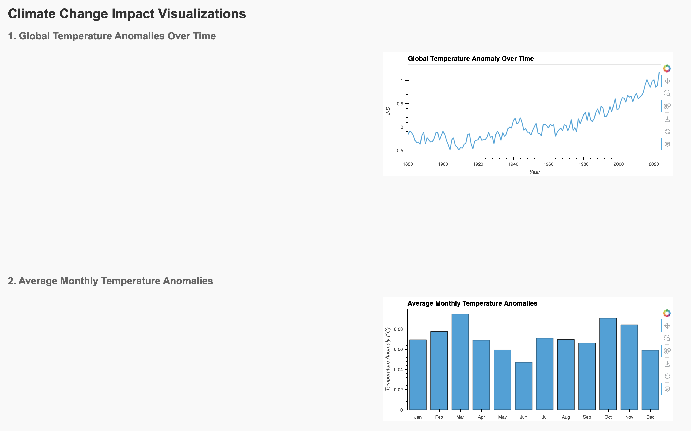

# Climate Change and Environmental Impact Visualization



## Table of Contents
- [Overview](#overview)
- [Background](#background)
- [Features](#features)
- [Dataset](#dataset)
- [Technologies Used](#technologies-used)
- [Installation](#installation)
- [Usage](#usage)
- [Deployment](#deployment)
- [License](#license)
- [Acknowledgements](#acknowledgements)

## Overview
The **Climate Change and Environmental Impact Visualization** project is an interactive web application that visualizes critical environmental data, including global temperature changes, CO2 emissions, deforestation rates, and air quality indices. The application allows users to explore environmental trends and metrics across different regions and over time. Through interactive charts and maps, users can better understand the impacts of climate change on various ecosystems and regions.

## Background
Climate change is one of the most significant global challenges, impacting ecosystems, weather patterns, and human life. This project leverages datasets from NASA, the Global Carbon Atlas, and the Global Forest Watch to present a comprehensive view of how human activities are contributing to changes in global temperatures, CO2 emissions, deforestation, and air quality.

This project will help visualize these key environmental metrics, providing a tool for educators, policymakers, and the public to explore how different regions are being affected by climate change.

The project is divided into several components:

### Key Objectives:
1. **Global Temperature Trends**: Visualize global temperature anomalies over time using historical data.
2. **CO2 Emissions and Deforestation Rates**: Compare and analyze trends in CO2 emissions and deforestation rates across different regions.
3. **Air Quality Analysis**: Visualize how air quality indices correlate with temperature changes in various parts of the world.
4. **Interactive Dashboards**: Provide users with interactive controls to explore and filter data based on country and environmental metric.

## Features
- **Interactive Map**: A choropleth map displaying global temperature changes over time across various regions.
- **Trend Comparison**: Line charts comparing CO2 emissions with deforestation rates.
- **Dynamic Filters**: Dropdowns and sliders for users to select countries and specific time ranges.
- **Data-Driven Insights**: Visualize how deforestation and emissions impact global temperatures and air quality.

## Dataset
The data for this project comes from various authoritative sources:

- **Global Temperature Data**: Provided by NASA GISS Surface Temperature Analysis (GISTEMP).
- **CO2 Emissions**: Data from the Global Carbon Atlas.
- **Deforestation Rates**: Sourced from Global Forest Watch.
- **Air Quality Indices**: Collected from the World Health Organization (WHO) air quality database.

## Technologies Used
- **Python (Pandas, Matplotlib, Plotly)**: For data processing and visualization.
- **JavaScript (D3.js, Plotly, Leaflet.js)**: For creating interactive maps and charts.
- **PostgreSQL/MongoDB**: Database to store and retrieve environmental data.
- **Flask/Dash**: For building the web-based interactive dashboard.
- **HTML/CSS**: For styling the web interface.
- **GitHub Pages/Heroku**: For deploying the project online.

## Installation
To run this project locally, follow these steps:

1. **Clone the Repository**:
   ```bash
   git clone git@github.com:maslla100/Climate-Change.git
   ```
2. **Navigate to the Project Directory**:
   ```bash
   cd climate-change-impact-project
   ```
3. **Install Required Libraries**:
   ```bash
   pip install -r requirements.txt
   ```
4. **Run the Flask/Dash Application**:
   ```bash
   flask run
   ```

## Usage
1. **Explore Temperature Data**:
   - The interactive map displays temperature anomalies over time, allowing users to explore different regions.
2. **Toggle Environmental Metrics**:
   - Use the dashboard controls to compare CO2 emissions with deforestation rates or view air quality indices by country.
3. **Analyze Trends**:
   - Line charts and visualizations help users interpret how environmental metrics have changed over time.

## Deployment
The project is deployed on GitHub Pages/Heroku. You can view the live application here:
- [Live Application](https://climate-change-6b823b572cf8.herokuapp.com/)

## License
This project is licensed under the MIT License. See the [LICENSE](LICENSE) file for more details.

## Acknowledgements
- **NASA GISS**: For providing global temperature datasets.
- **Global Carbon Atlas**: For the CO2 emissions data.
- **Global Forest Watch**: For deforestation data.
- **World Health Organization (WHO)**: For air quality data.
- **OpenStreetMap**: For the tile layer used in the interactive maps.
- **Plotly/D3.js communities**: For the powerful libraries that made the visualizations possible.

